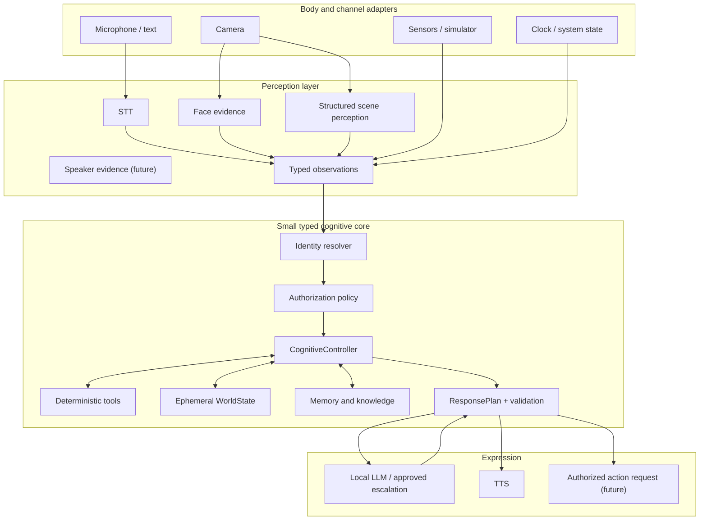

# Iroko cognitive architecture

> **Status:** Canonical target architecture
>
> **Scope:** Software brain before new electronics
>
> **Maxim:** A small typed Python orchestrator, not a giant framework or a
> multi-agent system.

## Product intent

Iroko is a local, open-source household companion with voice, vision, memory,
personality, and eventually a physical body. The same brain is exercised first
through the PC microphone, camera, speakers, and local web interface. Hardware
later replaces adapters; it does not redefine cognition.

The target experience is:

> “Iroko, ¿cuántos hijos tengo, qué edades tienen y qué ves?”

Iroko should identify or confirm the speaker, check access, query family
relationships, calculate ages from birth dates, inspect current structured
perception, distinguish facts from uncertain observations, and answer without
inventing. If information is missing, ambiguous, contradictory, or forbidden,
that state is the answer.

## From language pipeline to cognitive loop

NLP, NLU, and NLG describe only the language portion:

- **NLP:** processing human language as the broad discipline;
- **NLU:** extracting intent, entities, references, and meaning;
- **NLG:** expressing a result in natural language;
- **STT/ASR:** converting audio into text;
- **TTS:** converting response text into speech.

A household robot also needs:

- multimodal perception;
- face and speaker identity evidence;
- speaker diarization when several people participate;
- active-person resolution;
- current context and world state;
- declarative, episodic, semantic, and later procedural memory;
- a relational knowledge model;
- uncertainty and provenance;
- deterministic tools;
- authorization and consent;
- executive control;
- response planning and validation;
- memory consolidation and forgetting;
- hardware abstraction and physical safety.

The full cognitive loop is:

```text
Perceive -> Identify -> Understand -> Retrieve -> Reason
        -> Decide -> Respond -> Learn or decline to learn
```

It is functionally inspired by cognition; it does not claim to reproduce a
human brain.

## Non-negotiable principles

1. **Local-first:** core household behavior works without Internet.
2. **Open-source-first:** prefer inspectable, replaceable local components.
3. **Unknown is valid:** never force a plausible answer from missing evidence.
4. **Identity is evidence, not permission:** recognition never grants access by
   itself.
5. **Authorization before retrieval:** protected data does not enter an LLM
   prompt and get filtered afterward.
6. **Deterministic where possible:** dates, counts, relations, permissions,
   thresholds, and safety rules live in code.
7. **LLMs are specialized tools:** they interpret ambiguity and generate
   language; they do not own every decision.
8. **Current state is not memory:** transient perception uses TTL and only
   significant events are candidates for episodes.
9. **Body and brain are independent:** hardware-specific drivers terminate at
   adapters.
10. **Timestamps at the source:** observations and events can be correlated and
    replayed.
11. **Graceful degradation:** component failure preserves every safe local
    capability still available.
12. **Incremental architecture:** implement one verified vertical slice at a
    time; do not build future infrastructure early.

ADR-0004 governs local/cloud and uncertainty. ADR-0005 governs the controller
shape.

## System layers



Information flows upward from adapters as observations. Decisions flow downward
as response or action plans. Application code never reaches through the
controller to hardware drivers.

## Core runtime contracts

The exact baseline is defined in [`cognitive-contracts.md`](cognitive-contracts.md).
The important separation is:

- `Observation[PayloadT]`: something a source perceived, with time and
  confidence;
- `CognitiveEvent[PayloadT]`: a completed occurrence entering the cognitive
  flow;
- `ActivePersonContext`: who may be participating, based on evidence;
- `AuthorizationDecision`: what use of which data is allowed;
- `ActiveContext`: immutable evidence assembled for one turn;
- `KnowledgeStatus`: `known`, `unknown`, `ambiguous`, `contradictory`, or
  `unauthorized`;
- `ResponsePlan`: claims, questions, language intent, memory proposals, and
  authorized action requests produced by the controller.

Confidence never replaces a categorical knowledge status or authorization.

## The small cognitive controller

The target interface is conceptually:

```python
class CognitiveController:
    async def handle(self, event: CognitiveEvent[EventPayloadT]) -> ResponsePlan: ...
```

This is an architectural signature, not authorization to implement it outside
a ready plan.

### Stage 1 — Validate the event

Reject malformed identifiers, naive timestamps, expired observations, unknown
schema versions, and payloads that do not match their event type. Validation
does not perform I/O or select a model.

### Stage 2 — Resolve the active person

Combine available face, voice, session, manual, and context evidence. Default to
`unknown`; conflicting evidence produces `ambiguous`. Never silently substitute
the configured owner.

### Stage 3 — Authorize intended use

Evaluate the actor, requested action, data categories, visibility, sensitivity,
consent, and confidence requirements. Denied data is not retrieved. Actions may
require confirmation even when reading is allowed.

### Stage 4 — Determine information needs

Produce a small internal request: required people, relations, facts,
observations, or tools. Prefer structured intent/routing and simple rules for
known household questions. An LLM may help interpret genuinely ambiguous
language but does not get unrestricted data access.

### Stage 5 — Execute deterministic tools

Initial tools include:

- `get_children(person_id)`;
- `count_relationships(person_id, predicate)`;
- `get_person_details(person_id, fields)`;
- `calculate_age(birth_date, on_date)`;
- `get_current_date()`;
- `get_known_preferences(person_id)`;
- `get_current_perception()`;
- `remember_confirmed_fact(...)` only after policy and confirmation.

Tools return typed results with knowledge status, evidence references, and safe
errors. The LLM verbalizes results; it does not recount children or calculate
calendar age from prose.

### Stage 6 — Retrieve permitted memory

Apply person, household, visibility, sensitivity, freshness, and relevance
filters before constructing prompt context. Relational facts are preferred for
exact household questions; vector retrieval supplements them rather than
overriding them.

### Stage 7 — Assemble active context

Combine only the facts, episodes, current observations, identity evidence, and
authorization needed for this turn. `conversation_id` separates short working
history; it is not identity or permission.

### Stage 8 — Generate language when needed

The LLM receives a bounded response task, evidence-backed structured results,
personality directives, and allowed context. Local generation is the default.
Cloud escalation follows ADR-0004 and never occurs merely because confidence is
low.

### Stage 9 — Validate the response plan

Check that factual claims refer to tool results or permitted evidence, that an
unknown result was not turned into certainty, that protected data is absent,
and that actions retain required confirmation and safety conditions.

The validator is not a second unconstrained agent. It is deterministic where
possible and may use a model only under an explicit later policy.

### Stage 10 — Propose memory changes

Conversation and perception produce candidates, not automatic truth. The
controller classifies them as confirmed, probable, observed, contradictory,
temporary, or sensitive. It may ask for confirmation, store an episode, update
world state, or decline to persist.

## Example: family knowledge plus current perception

User request:

> “Iroko, ¿cuántos hijos tengo, qué edades tienen y qué ves?”

Expected flow:

1. Face/session/voice evidence resolves Felipe or asks for confirmation.
2. Policy verifies the speaker may view family profiles and current camera
   perception.
3. `get_children(Felipe)` returns entity IDs, not names stored as relation
   targets.
4. Each child's ISO birth date is retrieved.
5. `calculate_age()` computes age for the current local date.
6. Current, unexpired `WorldState` reports visible people, objects, relations,
   location hypothesis, and confidence.
7. The response planner keeps distinctions:
   - family relations and dates are verified knowledge;
   - “taza” may be a high-confidence current observation;
   - “café” may remain an uncertain inference unless another sensor or user
     statement supports it.
8. The LLM expresses only these results in Iroko's style.

If the speaker is ambiguous, the birth date is missing, or camera access is
denied, the response states each limitation independently.

## Perception model

Perception adapters translate vendor-specific output into typed payloads:

```text
webcam / CSI / security camera -> VisualObservation
microphone / audio file        -> AudioObservation
ESP32 / simulator              -> SensorObservation
web / voice / CLI              -> TextObservation
```

The shared brain does not know whether an image came from OpenCV, OAK-D,
Jetson, a USB webcam, or future electronics. Concrete payloads are introduced
only when their feature plan is ready.

Structured visual perception should eventually express:

- visible people and face evidence;
- objects and their confidence;
- relations such as `person holds cup`;
- a location hypothesis;
- source frame time and expiration;
- a short natural-language summary for response generation.

It must not claim substance, identity, action, or location with more certainty
than the evidence supports.

## Memory and world distinctions

```text
WorldState       = what may be true now, with TTL
Event            = something that happened
Episodic memory  = a retained experience
Semantic memory  = stable learned knowledge
Knowledge graph  = typed entity relationships and literal facts
Procedural memory= how to perform a learned task (deferred)
Working memory   = bounded current conversation state
```

Telemetry is not memory. Frames are not memory. LLM output is not evidence.
Promotion between layers follows the lifecycle in
[`memory-and-world-state.md`](memory-and-world-state.md).

## Personality boundary

Personality affects wording, initiative, curiosity, pacing, humor, and social
energy. It never changes knowledge status, invents memories, expands access,
overrides consent, or bypasses physical safety. See
[`personality-and-interaction.md`](personality-and-interaction.md).

## Cloud escalation boundary

Cloud is an optional capability used only after local processing and policy.
Appropriate candidates include resolving unusually ambiguous language,
verifying a contradictory extraction, generating a difficult explanation, or
analyzing a scene a local VLM could not interpret.

By default, do not send facial embeddings, voice samples, family profiles,
children's images, medical information, location history, full conversations,
home maps, the database, or raw memory dumps. A gateway sends a sanitized
minimum payload, records provider/model/cost/latency/result, has a timeout and
local fallback, and never writes SQLite directly.

## Physical body and ROS2

ROS2 is robotics communication infrastructure, not electronics and not the
cognitive brain. It becomes useful when real sensors, actuators, navigation,
multiple processes, timing, and long-running actions require it.

The intended later boundary is:

```text
CognitiveController -> authorized ActionRequest
        -> robotics communication layer / ROS2
        -> hardware abstraction
        -> ESP32 or drivers
        -> motors and sensors
```

The body enforces velocity, collision, timeout, heartbeat, and emergency-stop
rules even if the brain, network, or LLM fails. No cognitive milestone before
P3 requires ROS2.

## Explicit anti-goals

Do not add during the cognitive foundation:

- LangChain, CrewAI, AutoGen, LlamaIndex, Mem0, Letta, or an equivalent general
  orchestration framework;
- multiple LLM agents with separate goals;
- Neo4j or another graph database;
- Redis, Kafka, Celery, Kubernetes, or new microservices;
- continuous 30 FPS VLM inference;
- ROS2, navigation, or motor control;
- a cloud fallback that bypasses policy;
- autonomous memory writes from unverified model output;
- a single giant master prompt as the source of architecture.

## Success definition before electronics

Using only the PC and local services, Iroko must be able to:

1. accept voice and text through the same cognitive core;
2. resolve, confirm, or explicitly not know the active person;
3. prevent unauthorized family-memory retrieval;
4. answer relational household questions from entity IDs;
5. calculate ages deterministically from ISO dates;
6. combine verified family knowledge with current structured perception;
7. preserve corrections and multi-valued preferences;
8. distinguish observation, hypothesis, and confirmed knowledge;
9. remain functional without Internet;
10. fail with a useful unknown/ambiguous/unauthorized result instead of a
    confident false positive.

The ordered implementation path is defined in
[`../roadmap/cognitive-roadmap.md`](../roadmap/cognitive-roadmap.md).
