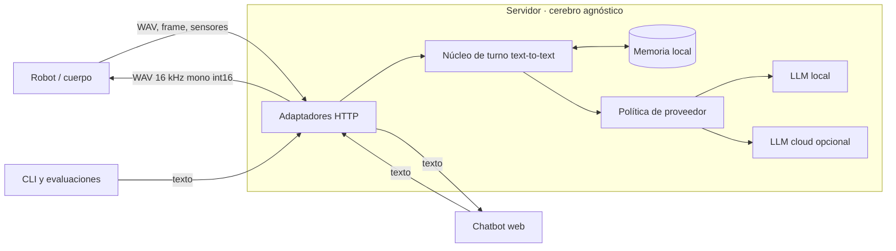

# Roadmap del cerebro agnóstico antes de la electrónica

> **Estado:** Registro histórico de ejecución al 2026-07-29, reconciliado
> parcialmente con el árbol actual al 2026-08-04. Para nuevas
> prioridades cognitivas fue reemplazado por
> [`../roadmap/cognitive-roadmap.md`](../roadmap/cognitive-roadmap.md).
> **Fecha:** 2026-07-29
> **Alcance:** cerebro, memoria, canales de interacción, proveedores de modelos,
> evaluación y simulación previa al BOM.

## Propósito

Iroko debe separar tres responsabilidades:

1. El **cuerpo** percibe y actúa: micrófono, cámara, parlante, sensores,
   indicadores, motores y seguridad física.
2. El **cerebro** comprende, recuerda y decide mediante una API genérica.
3. Los **canales** transportan interacciones: robot por voz, chatbot web por
   texto y herramientas de diagnóstico por CLI.

El servidor no debe saber si el texto llegó desde un Omnibot, un navegador o
un test. El cuerpo tampoco debe conocer Whisper, Ollama, Anthropic, Piper,
SQLite ni el modelo activo. Esta frontera permite cambiar hardware, interfaz
o proveedor sin reescribir el razonamiento.

## Artefactos de ejecución

- Política cognitiva local-first: `docs/adr/0004-local-first-cognitive-policy.md`.
- Contratos independientes de hardware y proveedor:
  `docs/architecture/cognitive-contracts.md`.
- Planes pequeños y ejecutables: `docs/plans/README.md`; el primer plan es
  `docs/plans/0001-cognitive-domain-models.md`.
- La evidencia histórica y los guiones operativos permanecen en `docs/local/`;
  son material local no versionado y no constituyen requisitos implícitos para
  ejecutar un plan.

## Decisiones y propuestas

| ID | Decisión | Estado |
|---|---|---|
| CA-01 | El servidor es un cerebro agnóstico de canal y hardware. | Aceptada; reafirma la arquitectura vigente |
| CA-02 | Robot, web y CLI comparten memoria persistente del hogar. | Implementada en M3; web sin consolidación automática |
| CA-03 | Cada canal mantiene una conversación de trabajo separada mediante un `conversation_id`; no crea otro dueño ni otra memoria. | Implementada y probada en M3 |
| CA-04 | El procesamiento es local por defecto; cloud es un escalamiento autorizado, mínimo y auditable. | Aceptada por ADR-0004 |
| CA-05 | SaaS, multi-tenant, billing y acceso público no son requisito para un chatbot local. | Aceptada por alcance |
| CA-06 | El simulador y el hardware futuro usan el mismo contrato de sensores. | Propuesta para F3A |

## Arquitectura objetivo



El núcleo común recibe texto y devuelve una respuesta textual estructurada.
Los endpoints adaptan medios, pero no duplican razonamiento:

- `POST /transcribe` permanece compatible: valida WAV, ejecuta STT, núcleo de
  turno y TTS. No se elimina ni renombra ningún campo.
- `POST /chat` recibe JSON y ejecuta solo texto → texto, sin pagar
  STT ni TTS.
- `/vision/respond` transforma un frame efímero en percepción textual y usa
  el mismo núcleo.
- F3A enviará lecturas con timestamp mediante un contrato idéntico para
  simulador y hardware.

El documento histórico de SaaS propuso `/v1/chat`. Para el runtime local se
debe decidir primero una política general de versionado; un gateway futuro
puede exponer `/v1/chat` sin duplicar la lógica interna.

## Contrato textual vigente

```json
POST /chat
{
  "message": "¿Cómo se llaman mis hijos?",
  "conversation_id": "web-principal"
}
```

```json
200
{
  "response": "Tus hijos se llaman Máximo y Dominga.",
  "emotion": "neutral",
  "duration_ms": 840,
  "conversation_id": "web-principal"
}
```

`conversation_id` separa el historial corto de una pestaña web del diálogo
hablado del robot. Los hechos, correcciones, personas y recuerdos duraderos
siguen perteneciendo a la única memoria local del hogar. No es un
`account_id`, no introduce multi-tenancy y no autoriza acceso remoto.

El núcleo debe vivir como servicio Python compartido. `/transcribe` y `/chat`
lo invocan directamente; un endpoint nunca debe llamarse a sí mismo por HTTP.

## Política local/cloud

ADR-0004 gobierna esta política. Cloud puede liberar CPU/RAM o mejorar una tarea
difícil, pero no es el cerebro primario ni mueve la fuente de verdad:

- STT, memoria SQLite, retrieval, caras y políticas determinísticas permanecen
  locales inicialmente.
- Solo se envía al proveedor el texto y el contexto mínimo necesario; nunca
  audio, frames ni la base completa.
- Chat y consolidación conservan proveedores configurables por separado.
- El modo híbrido necesita timeout, fallback local, circuit breaker, métricas
  de costo y registro del proveedor/modelo usado.
- Una caída de Internet produce una respuesta local degradada o una
  explicación hablada; nunca silencio ni pérdida de memoria.
- Un resultado `unknown`, `ambiguous`, `contradictory` o `unauthorized` no
  escala automáticamente: primero debe pasar la política de autorización.

Una ampliación de los datos permitidos o el uso cotidiano de cloud requiere un
nuevo ADR que sustituya explícitamente ADR-0004.

## Roadmap reordenado

| Orden | Hito | Entregable y criterio de salida |
|---:|---|---|
| 0 | M1 — checkpoint manual paralelo | Repetir pasos 7-8 cuando el dueño opere el hardware. Sigue abierto, pero no bloquea el eval aislado M2. |
| 1 | M2 — Context Faithfulness | **Completo 2026-07-29.** `just eval-chat`, 12 casos sintéticos y tres repeticiones. Baseline Ollama `qwen2.5:3b`: pass rate 50,00%, required recall 60,78%, forbidden violations 8,33%, stability 41,67%, p50 8,79 s y p95 14,43 s; 0/36 errores de provider. Evidencia: bitácora 023. |
| 2 | M3 — Núcleo text-to-text | **Completo 2026-07-29.** Servicio compartido para chat, voz y visión; streaming reutiliza preparación/registro; `/chat` aditivo y `/transcribe` compatible. Gate: 409 tests. Evidencia: bitácora 024. |
| 3 | M4 — Chatbot de diagnóstico | Cliente web local mínimo que comparta memoria persistente y use una sesión de trabajo propia. El árbol actual contiene la implementación, pero no evidencia histórica preservada de cierre. Sin SaaS, autenticación pública ni dashboard comercial. |
| 4 | M5 — Comparación local/cloud | Ejecutar el mismo golden set con Ollama y Anthropic; medir fidelidad, latencia, RAM, tokens y costo antes de elegir política. |
| 5 | M6 — Providers y fallback | Interfaz pequeña para chat local/cloud, capacidades de streaming y failover explícito. No construir un framework dinámico de plugins. |
| 6 | M7 — Contexto fundamentado | Presupuesto por tokens, ventana corta, hechos con IDs internos, respuesta validable y fallback determinístico ante contradicciones. |
| 7 | R5 — Retrieval híbrido | Relacional primero; después keyword/vector con umbral, ranking, importancia y decay temporal. |
| 8 | M8 — Presupuesto de recursos | Serializar cargas pesadas, diferir consolidación y medir RAM/CPU para impedir que chat, VLM y consolidación compitan sin límite. |
| 9 | R4 — TTS por adapters | Mantener Piper y comparar candidatos con frases chilenas cortas. Normalizar toda salida a WAV 16 kHz mono int16. |
| 10 | R6 — Reflexiones | Solo después de demostrar que mejoran el eval sin contaminar hechos ni exceder el presupuesto. |
| 11 | F3A — Sensores emulados | Temperatura y eventos falsos atraviesan el mismo contrato que usará el cuerpo real; validar estado actual, TTL y degradación. |
| 12 | M1-RC — aceptación final | Revalidar en PC voz, memoria/corrección tras reinicio, visión, caras, provider local y degradación después de cambiar el núcleo. |

R7, R10, F5, SaaS y electrónica quedan detrás de estos gates: mejoran la
experiencia o amplían el producto, pero no resuelven primero la fidelidad del
cerebro.

### Reconciliación posterior de M4

El plan histórico de M4 en `docs/local/` registraba la implementación como no
iniciada al 2026-07-29. El árbol actual contiene `server/chat_ui.py`, los
assets estáticos bajo `server/static/chat/`, su montaje en `server.main` y
`tests/integration/test_chat_ui.py`. El origen exacto disponible es el commit
consolidado `7577217` (`chore: initial public release`), no la rama histórica
`feat/m4-diagnostic-chat-ui`.

No se preservó evidencia positiva de los criterios de cierre históricos:
Playwright determinístico, inspección del wheel, smoke real con provider local,
bitácora `025_m4_diagnostic_chat_ui.md` y `just gate`. Por tanto, M4 se describe
solamente como **implementado con cierre histórico no demostrado**. No se debe
retomar `feat/m4-diagnostic-chat-ui` sin compararla antes con `origin/main`.

### Evidencia de cierre M2

M2 aisló `generate_response()` de STT, retrieval, SQLite, embeddings, visión y
TTS mediante contextos e historiales sintéticos. El corpus cubre datos
presentes/ausentes, correcciones, distractores, identidad, percepción resuelta,
múltiples hechos y persistencia simulada tras reinicio. Los tests no usan red;
el baseline real sí usa el provider configurado explícitamente.

El baseline local limpio ejecutó 12 casos por tres repeticiones con Ollama
`qwen2.5:3b` y 36 respuestas HTTP correctas. El resultado bajo es evidencia de
fidelidad insuficiente del generador, no una falla del evaluador. Anthropic no
se ejecutó por falta de autorización explícita de consumo; la comparación
formal local/cloud permanece en M5. Ver
`docs/local/bitacora/023_m2_context_faithfulness.md` (evidencia local no
versionada).

### Evidencia de cierre M3

M3 agregó `POST /chat` con cuatro campos de respuesta, aisló working memory por
`conversation_id` y conservó una sola memoria persistente local. Web no
consolida hechos sin autorización; voz sí y visión no. `/transcribe` mantiene
su contrato WAV/HTTP y streaming conserva NDJSON incremental.

Los tests dirigidos terminaron 82/82 y `just gate` 409/409. Un smoke real con
Ollama `qwen2.5:3b` alternó dos conversaciones sin compartir historial; cuatro
llamadas respondieron HTTP 200. El caso M2 solicitado pasó 1/1 sin errores de
provider. Ver `docs/local/bitacora/024_m3_text_turn_chat.md` (evidencia local
no versionada).

## Gates antes de comprar electrónica

- Preguntas con evidencia usan únicamente hechos activos y nunca versiones
  superseded.
- Ante información ausente, Iroko admite que no recuerda en vez de inventar.
- Robot y web obtienen la misma verdad persistente sin compartir historial
  conversacional accidentalmente.
- El cambio de proveedor no modifica contratos HTTP ni esquema de memoria.
- Se registran proveedor, modelo, latencia, contexto recuperado y resultado
  con retención local controlada.
- El crecimiento de una conversación tiene límites medidos de tokens, RAM y
  latencia.
- El simulador de sensores puede reemplazarse por firmware sin cambiar el
  núcleo.
- `just gate` y el recorrido E2E correspondiente quedan verdes.

## Límite de lo demostrable sin hardware

Antes del BOM se puede alcanzar un **cerebro release candidate**: voz y texto,
memoria corregible, visión por webcam, evaluación reproducible, proveedores
intercambiables, TTS sustituible y sensores simulados.

No se puede declarar robustez física sin medir micrófonos dentro del chasis,
eco, alimentación, temperatura, conectividad, calibración de sensores,
latencia del firmware, motores, parada local y comportamiento ante fallos
eléctricos. El simulador valida el contrato; el hardware valida el mundo real.

## Preguntas que requieren decisión del dueño

1. ¿El modo cloud será solo herramienta de desarrollo o una opción soportada
   en producción?
2. ¿El chatbot web será exclusivamente LAN/VPN durante esta etapa?
3. ¿Las conversaciones web pueden consolidar hechos automáticamente o
   requieren confirmación explícita?
4. ¿Qué presupuesto mensual y qué datos personales se permite enviar al
   proveedor cloud?
