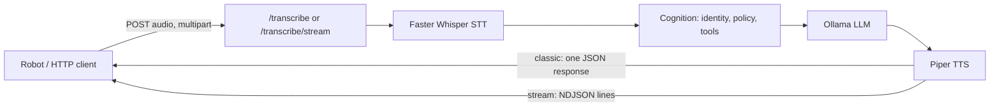

# Server

`server/` is Iroko's generic HTTP audio API — it exposes STT/LLM/TTS over
FastAPI and never knows a physical robot exists. `robot/` is a generic audio
client and never knows STT/LLM/TTS exist. Neither package imports the other;
they share only the HTTP contract below. See the root `CLAUDE.md`/`AGENTS.md`
for the full project identity and this boundary's rationale.

## Request flow



`/chat` follows the same cognition → LLM path without the STT/TTS legs, for
text-only channels.

## Setup and run

```powershell
just setup        # uv sync + pre-commit install + secrets baseline
just run-server    # loads .env, starts Uvicorn on server_host:server_port
```

`just run-server` always loads `.env` — see `.env.example` for every
recognized variable and its default. Never hardcode a model name, path, or
port; every one of them is a `Settings` field (`server/src/server/settings.py`,
`pydantic-settings`, `BaseSettings`).

## Configuration

Selected settings that shape runtime behavior — the full list lives in
`Settings` itself, always the source of truth over this table:

| Variable | Default | Meaning |
|---|---|---|
| `SERVER_HOST` | `127.0.0.1` | Loopback by default (ADR-0013); LAN exposure is an explicit opt-in, never the default |
| `SERVER_PORT` | `8000` | |
| `UVICORN_WORKERS` | `1` (fixed, `Literal[1]`) | Owner-unlock grants, SQLite state, and background jobs are process-local (ADR-0010) — a second worker would silently split them |
| `UVICORN_PROXY_HEADERS` | `false` | Never trusts a proxy-forwarded header unless explicitly configured (ADR-0013) |
| `MEMORY_ENABLED` | see `.env.example` | Gates whether the SQLite-backed memory subsystem opens at all |
| `WHISPER_MODEL` / `PIPER_VOICE` / `OLLAMA_MODEL` | see `.env.example` | STT/TTS/LLM model selection |
| `MAX_AUDIO_UPLOAD_BYTES` / `MAX_IMAGE_UPLOAD_BYTES` | `10 MB` / `5 MB` | Per-file upload ceilings, checked after the raw ASGI body limit (Plan 0034) |
| `UVICORN_LIMIT_CONCURRENCY` | `100` | See "Capacity policy" below — uncalibrated, not a capacity guarantee |
| `UVICORN_MAX_REQUESTS` | unset | See "Capacity policy" below — requires a supervisor that does not exist yet |

## API documentation

With the server running: interactive docs at `GET /docs`, ReDoc at
`GET /redoc`, and the raw machine-readable contract at `GET /openapi.json`
(Plan 0040 — every route's tags, typed responses, and real error codes are
generated from the code, not hand-maintained).

## Health and readiness

Two distinct probes (Plan 0040):

- `GET /health` — liveness only. Returns `200` once the process answers
  requests at all.
- `GET /ready` — readiness. Returns `200` only once the lifespan has
  completed and every mandatory local resource is confirmed loaded (STT
  model, TTS voice, and the database when `MEMORY_ENABLED=true`), with no
  network or model call of its own. Returns `503` with a specific reason
  otherwise. Vision is always optional and never part of this check.

## Streaming contract

`POST /transcribe/stream` returns `media_type="application/x-ndjson"` — one
JSON object per line, in order: an optional `text_heard` event, an `emotion`
event, zero or more `audio` events (one per synthesized sentence), and
exactly one terminal event — `done` (with per-stage timing) or `error` (a
stable `code`, a fixed client-safe `detail`, and whether retrying may help).
Every started stream is guaranteed to end in exactly one terminal event
followed by EOF, never a silent truncation (ADR-0012,
`streaming.guarantee_terminal_event()`). Native FastAPI JSON Lines
(`-> AsyncIterable[Model]`, `application/jsonl`) was measured and is
available on the pinned FastAPI version, but is not adopted here — see
`docs/architecture/server-production-baseline.md`'s "Verified baseline" for
the measured blocker.

## Testing

```powershell
just test              # full suite, parallel (pytest-xdist)
just test-cov           # + HTML coverage report, 80% floor
uv run pytest -m unit   # pure logic only, no external dependencies
```

Test markers: `unit` (pure logic), `integration` (real hardware/local
models/DB), `slow` (audio/model processing). CI runs
`not slow and not hardware and not eval` with an 80% coverage floor; the
full local `just test` (including `integration`) is the closer-to-real gate
and the one that must also pass before any release.

## Deployment posture

Local-first by default: loopback binding, disabled proxy-header trust, no
CORS (ADR-0013). LAN or reverse-proxy exposure is an explicit, reviewed
deployment decision — not a default this server ever assumes. One Uvicorn
worker, always (see Configuration above). No process supervisor (systemd or
equivalent) exists yet; `UVICORN_MAX_REQUESTS` stays unset until one does —
see "Capacity policy" below. Real supervised deployment is verified on the
target Linux homelab server directly, never fabricated from a Windows dev
machine.

## Capacity policy (Plan 0038)

The server runs as **one Uvicorn worker, always** — `uvicorn_workers` is
`Literal[1]` in `Settings`; owner-unlock grants, SQLite state, and background
jobs are process-local (ADR-0010), so a second worker would silently split
them across processes instead of sharing them.

Two runtime knobs bound load, and **neither one creates capacity**:

- `UVICORN_LIMIT_CONCURRENCY` (default `100`, uncalibrated) — once this many
  connections are open at once, Uvicorn returns `503 Service Unavailable` to
  any new one. It does not queue them, and it does not make the process
  handle more work; it only decides where the line is drawn.
- `UVICORN_MAX_REQUESTS` (default unset) — if set, Uvicorn exits the worker
  process after handling that many requests. **This requires a supervisor
  that restarts the process** (systemd, a container orchestrator, a process
  manager). Iroko has none today. Setting this without one turns a normal
  request into an outage: the server simply stops and stays stopped. Leave
  it unset until a real supervisor exists and is verified to restart the
  process reliably.

### Measuring real capacity

`100` is the value this project already ran with before Plan 0038 — carried
forward, not newly chosen. No specific number in this document is a measured
production target; measure on the actual target hardware before trusting one.

To measure, run a real load tool (e.g. `hey`, `wrk`, or `locust`) against a
running `just run-server` instance, and record — for **your real target
hardware**, not this laptop — latency and error rate at each of:

| Concurrency | p50 latency | p99 latency | Error rate | Notes |
|---:|---|---|---|---|
| 2 | | | | |
| 4 | | | | |
| 8 | | | | |
| 100 (current default) | | | | |

A turn touches Whisper, Ollama, and Piper in sequence — CPU- and
memory-bound, not I/O-bound — so the useful concurrency ceiling on a home
server is likely far below `100`. Lower `UVICORN_LIMIT_CONCURRENCY` only
after a real measurement says so; raising it without measurement risks
paging the machine into swap under real load instead of returning a fast
`503`.

### Graceful shutdown

`UVICORN_TIMEOUT_GRACEFUL_SHUTDOWN` (default `30` seconds) bounds how long
Uvicorn waits for in-flight requests to finish before forcing a stop —
important here because a single turn (STT → LLM → TTS) can itself take
several seconds. `UVICORN_TIMEOUT_KEEP_ALIVE` (default `5` seconds) is the
existing, unchanged HTTP keep-alive idle timeout.
